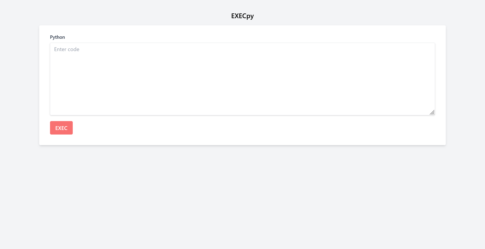
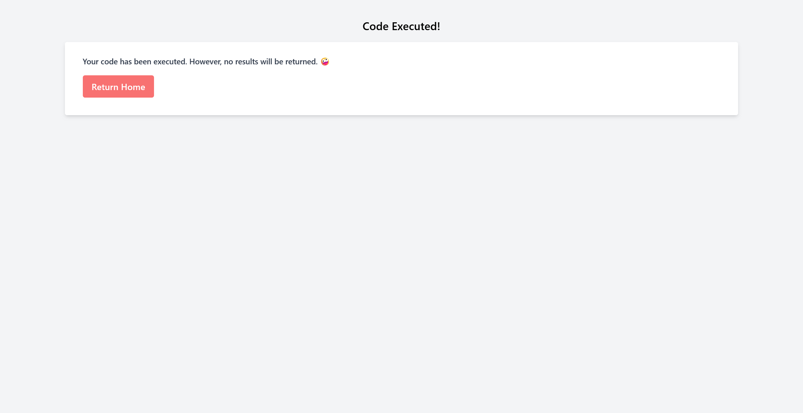
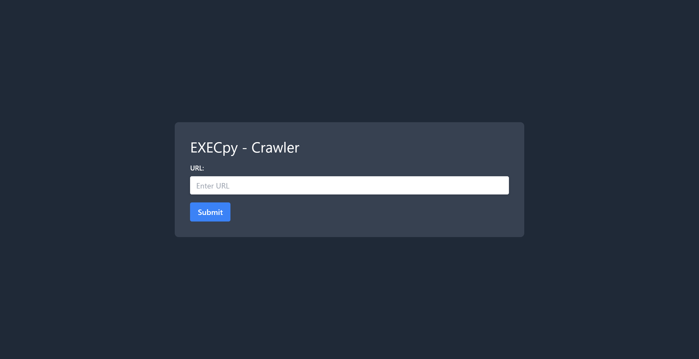

# EXECpy

## 問題文
RCEがめんどくさい？  
データを`exec`に渡しといたからRCE2XSSしてね！  

[http://118.27.109.12:31416](http://118.27.109.12:31416)  

**AdminBot:** [http://118.27.109.12:31416/crawler](http://118.27.109.12:31416/crawler)  

[EXECpy.zip](files/EXECpy.zip)  

Hint  
wowwow  

## 難易度
**hard**  

## 作問にあたって
DEF CON 31で小さく開催されていたSpaceX Security Challengeにpotetisenseiと出た際のテクニックをXSSに落とし込みました。  
pickleでRCEができるシナリオでサーバ内部のバイナリを取得する必要があったのですが、アウトバウンド通信や応答時間でのオラクルができない(共に運営インフラの問題)状況でした。  
そこで開いているfdに取得したいデータを流し込んでHTTP応答として返すことで、入手する手法を用いていました。  
現実ではXSS2RCEは最高ですが、RCE2XSSはうれしくないです。  

## 解法
URL、AdminBot、ソースコードが渡される。  
アクセスするとPythonのexecでコードを実行できる謎のサービスだ。  
  
ただし実行結果は返してくれない。  
  
URLは`http://118.27.109.12:31416/?code=print%281%29`であり、コードをクエリに渡せる。  
AdminBotがあることからもXSS問題だろう。  
  
ソースを見るとメインのアプリケーションは以下の通りであった。  
```python
from flask import Flask, render_template, request

app = Flask(__name__)


@app.route("/", methods=["GET"])
def index():
    code = request.args.get("code")
    if not code:
        return render_template("index.html")

    try:
        exec(code)
    except:
        pass

    return render_template("result.html")


if __name__ == "__main__":
    app.run(debug=True, host="0.0.0.0", port=31416)
```
クローラーも見ると以下のように、Playwrightでcookieにフラグを付けてユーザの入力URLにアクセスしている。  
ただし、フラグが付くためには`if ("Tsukushi/2.94" in header) and ("🤪" not in content):`の制限がある。  
```python
import os
import asyncio
from playwright.async_api import async_playwright
from flask import Flask, render_template, request

app = Flask(__name__)

DOMAIN = "nginx"
FLAG = os.environ.get("FLAG", "TsukuCTF23{**********REDACTED**********}")


@app.route("/crawler", methods=["GET"])
def index_get():
    return render_template("index_get.html")


async def crawl(url):
    async with async_playwright() as p:
        browser = await p.chromium.launch()
        page = await browser.new_page()

        try:
            response = await page.goto(url, timeout=5000)
            header = await response.header_value("Server")
            content = await page.content()

            if ("Tsukushi/2.94" in header) and ("🤪" not in content):
                await page.context.add_cookies(
                    [{"name": "FLAG", "value": FLAG, "domain": DOMAIN, "path": "/"}]
                )
                if url.startswith(f"http://{DOMAIN}/?code=") or url.startswith(
                    f"https://{DOMAIN}/?code="
                ):
                    await page.goto(url, timeout=5000)
        except:
            pass

        await browser.close()


@app.route("/crawler", methods=["POST"])
def index_post():
    asyncio.run(
        crawl(
            request.form.get("url").replace(
                "http://localhost:31416/", f"http://{DOMAIN}/", 1
            )
        )
    )
    return render_template("index_post.html")


if __name__ == "__main__":
    app.run(debug=True, host="0.0.0.0", port=31417)
```
もう一度メインのアプリケーションの応答を確認する。  
```bash
$ curl 'http://118.27.109.12:31416/?code=print%281%29' -I
HTTP/1.1 200 OK
Server: nginx/1.25.3
Date: Sat, 09 Dec 2023 00:00:00 GMT
Content-Type: text/html; charset=utf-8
Content-Length: 1059
Connection: close

$ curl 'http://118.27.109.12:31416/?code=print%281%29'
~~
                <p class="block text-gray-700 text-sm font-bold mb-2">
                    Your code has been executed. However, no results will be returned. 🤪
                </p>
~~~
```
`Server`レスポンスヘッダーは`nginx/1.25.3`であるので`Tsukushi/2.94`ではない。  
また、`🤪`もレスポンスbodyに含まれている。  
つまりexecを行うことでFlaskの応答結果のレスポンスヘッダーとレスポンスボディを書き換えてXSSする問題だとわかる。  
ここでexecがHTTP通信中に行われるため、Flask(かWerkzeug)がfdを保持しており、そこにデータを流し込むことでうまくレスポンスを書き換えることができそうだ。  
もしくは、execで自由度が高いのでPythonのメモリ上に乗っているテンプレートを書き換えることができるかもしれない。  
後者はアプリケーションを破壊しそうなので、前者を試す。  


## TsukuCTF23{175_4_73rr1bl3_4774ck_70_1n73rrup7_h77p}
